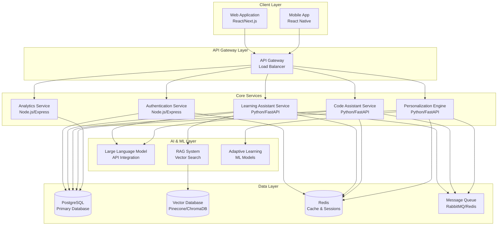

# Design Document: SmartLearn AI Platform

## Overview

SmartLearn AI is a comprehensive AI-powered learning and developer productivity platform that combines personalized learning assistance with intelligent coding support. The system leverages modern microservices architecture, retrieval-augmented generation (RAG), and adaptive learning algorithms to provide contextual, personalized educational experiences.

The platform addresses the core challenges of overwhelming technical documentation, complex concept understanding, and scattered learning resources by providing an intelligent assistant that adapts to individual user needs and skill levels.

## Architecture

### High-Level Architecture

The SmartLearn AI platform follows a microservices architecture pattern with clear separation of concerns, enabling independent scaling and deployment of different system components.



### Architectural Principles

1. **Microservices Design**: Each service handles a specific domain with clear boundaries
2. **Asynchronous Processing**: Heavy AI operations processed asynchronously to maintain responsiveness
3. **Horizontal Scalability**: Services can be scaled independently based on demand
4. **Fault Tolerance**: Graceful degradation when external services are unavailable
5. **Data Consistency**: Event-driven architecture for maintaining consistency across services

## Components and Interfaces

### Frontend Components

#### Web Application (React/Next.js)
- **Chat Interface**: Primary interaction component for user queries
- **Code Editor Integration**: Syntax-highlighted code input and explanation display
- **Learning Dashboard**: Progress tracking and personalized recommendations
- **Settings Panel**: User preferences and personalization controls

#### Mobile Application (React Native)
- **Responsive Chat Interface**: Optimized for mobile interactions
- **Offline Mode**: Cached responses for limited connectivity scenarios
- **Push Notifications**: Learning reminders and progress updates

### Backend Services

#### Authentication Service
**Technology**: Node.js with Express
**Responsibilities**:
- User registration and login
- JWT token management
- Role-based access control
- Session management

**Key Interfaces**:
```typescript
interface AuthService {
  register(userData: UserRegistration): Promise<AuthResponse>
  login(credentials: LoginCredentials): Promise<AuthResponse>
  validateToken(token: string): Promise<UserContext>
  refreshToken(refreshToken: string): Promise<AuthResponse>
}
```

#### Learning Assistant Service
**Technology**: Python with FastAPI
**Responsibilities**:
- Concept explanation generation
- Educational content retrieval
- Learning path recommendations
- Progress tracking

**Key Interfaces**:
```python
class LearningAssistantService:
    async def explain_concept(
        self, 
        concept: str, 
        user_context: UserContext,
        explanation_depth: ExplanationDepth
    ) -> ConceptExplanation
    
    async def generate_examples(
        self, 
        concept: str, 
        context: str
    ) -> List[Example]
    
    async def suggest_learning_path(
        self, 
        user_id: str, 
        target_skills: List[str]
    ) -> LearningPath
```

#### Code Assistant Service
**Technology**: Python with FastAPI
**Responsibilities**:
- Code analysis and explanation
- Debugging assistance
- Documentation summarization
- Best practice recommendations

**Key Interfaces**:
```python
class CodeAssistantService:
    async def explain_code(
        self, 
        code_snippet: str, 
        language: str,
        user_context: UserContext
    ) -> CodeExplanation
    
    async def suggest_debugging(
        self, 
        code: str, 
        error_message: str
    ) -> DebuggingSuggestion
    
    async def optimize_workflow(
        self, 
        current_workflow: str,
        user_preferences: UserPreferences
    ) -> WorkflowOptimization
```

#### Personalization Engine
**Technology**: Python with FastAPI
**Responsibilities**:
- User skill level assessment
- Learning context management
- Adaptive response generation
- Recommendation algorithms

**Key Interfaces**:
```python
class PersonalizationEngine:
    async def assess_skill_level(
        self, 
        user_interactions: List[Interaction]
    ) -> SkillAssessment
    
    async def update_learning_context(
        self, 
        user_id: str, 
        interaction: Interaction
    ) -> LearningContext
    
    async def personalize_response(
        self, 
        base_response: str,
        user_context: UserContext
    ) -> PersonalizedResponse
```

#### Analytics Service
**Technology**: Node.js with Express
**Responsibilities**:
- User behavior tracking
- Learning progress analytics
- Performance metrics
- Insight generation

### AI and ML Components

#### RAG System
**Technology**: Python with vector database integration
**Components**:
- **Document Ingestion Pipeline**: Processes and chunks educational content
- **Embedding Generation**: Creates vector representations of content
- **Semantic Search**: Retrieves relevant context for queries
- **Context Ranking**: Prioritizes most relevant information

**Key Interfaces**:
```python
class RAGSystem:
    async def ingest_documents(
        self, 
        documents: List[Document]
    ) -> IngestionResult
    
    async def semantic_search(
        self, 
        query: str, 
        filters: SearchFilters,
        top_k: int = 5
    ) -> List[SearchResult]
    
    async def generate_context(
        self, 
        query: str,
        search_results: List[SearchResult]
    ) -> GenerationContext
```

#### Adaptive Learning Models
**Technology**: Python with scikit-learn/TensorFlow
**Components**:
- **Skill Assessment Model**: Evaluates user competency levels
- **Learning Style Classifier**: Identifies preferred learning approaches
- **Difficulty Adjustment Algorithm**: Adapts content complexity
- **Progress Prediction Model**: Forecasts learning outcomes

## Data Models

### Core Entities

#### User Model
```typescript
interface User {
  id: string
  email: string
  username: string
  created_at: Date
  updated_at: Date
  preferences: UserPreferences
  learning_context: LearningContext
}

interface UserPreferences {
  explanation_style: 'detailed' | 'concise' | 'example-heavy'
  preferred_languages: string[]
  learning_goals: string[]
  notification_settings: NotificationSettings
}

interface LearningContext {
  skill_levels: Map<string, SkillLevel>
  learning_history: LearningInteraction[]
  current_focus_areas: string[]
  estimated_expertise: ExpertiseLevel
}
```

#### Interaction Model
```typescript
interface Interaction {
  id: string
  user_id: string
  type: 'concept_explanation' | 'code_analysis' | 'debugging_help'
  query: string
  response: string
  context_used: string[]
  feedback: UserFeedback
  timestamp: Date
  processing_time: number
}

interface UserFeedback {
  rating: number // 1-5 scale
  helpful: boolean
  clarity_rating: number
  accuracy_rating: number
  comments?: string
}
```

#### Knowledge Base Model
```typescript
interface KnowledgeDocument {
  id: string
  title: string
  content: string
  document_type: 'tutorial' | 'documentation' | 'example' | 'reference'
  topics: string[]
  difficulty_level: DifficultyLevel
  source: string
  embedding_vector: number[]
  metadata: DocumentMetadata
}

interface DocumentMetadata {
  author: string
  created_date: Date
  last_updated: Date
  version: string
  language?: string
  framework?: string
}
```

### Database Schema Design

#### PostgreSQL Tables
- **users**: Core user information and authentication
- **user_preferences**: Personalization settings and learning preferences
- **interactions**: All user interactions with the system
- **learning_sessions**: Grouped interactions representing learning sessions
- **knowledge_documents**: Metadata for documents in the knowledge base
- **user_progress**: Tracked learning progress and achievements
- **feedback**: User feedback and ratings for system responses

#### Vector Database Schema
- **document_embeddings**: Vector representations of knowledge documents
- **query_embeddings**: Cached embeddings for common queries
- **user_preference_vectors**: Vectorized user learning preferences

## Correctness Properties

*A property is a characteristic or behavior that should hold true across all valid executions of a system—essentially, a formal statement about what the system should do. Properties serve as the bridge between human-readable specifications and machine-verifiable correctness guarantees.*

Based on the prework analysis and property reflection, the following correctness properties ensure the SmartLearn AI platform meets its functional requirements:

### Learning Assistant Properties

**Property 1: Adaptive Explanation Generation**
*For any* concept and user context, explanations should be appropriately tailored to the user's skill level, using clear language and appropriate depth
**Validates: Requirements 1.1, 3.2, 3.3, 3.4**

**Property 2: Structured Concept Breakdown**
*For any* complex concept, explanations should contain step-by-step components that break down the topic systematically
**Validates: Requirements 1.2**

**Property 3: Example and Analogy Inclusion**
*For any* concept explanation, the response should include relevant real-world examples, and abstract concepts should additionally include analogies
**Validates: Requirements 1.3, 1.4**

**Property 4: Clarification Differentiation**
*For any* clarification request, the response should provide additional detail while being substantively different from the original explanation
**Validates: Requirements 1.5**

### Code Assistant Properties

**Property 5: Comprehensive Code Analysis**
*For any* valid code snippet, the explanation should include line-by-line functionality descriptions with proper syntax highlighting and formatting
**Validates: Requirements 2.1, 5.4**

**Property 6: Issue Detection and Debugging**
*For any* code containing potential issues, the system should identify problems and provide specific debugging approaches
**Validates: Requirements 2.2**

**Property 7: Documentation Summarization**
*For any* documentation request, summaries should be concise, actionable, and contextually relevant to the user's needs
**Validates: Requirements 2.3**

**Property 8: Contextual Workflow Optimization**
*For any* workflow assistance request, suggestions should be relevant to the user's demonstrated context and preferences
**Validates: Requirements 2.4**

**Property 9: Best Practice Integration**
*For any* code explanation, the response should highlight applicable best practices and potential improvements
**Validates: Requirements 2.5**

### Personalization Properties

**Property 10: Skill Assessment Consistency**
*For any* new user interaction sequence, the personalization engine should generate consistent skill level assessments based on demonstrated knowledge
**Validates: Requirements 3.1**

**Property 11: Learning Context Evolution**
*For any* user interaction over time, the learning context should be updated to reflect new knowledge and preferences demonstrated through questions and feedback
**Validates: Requirements 3.5**

### Knowledge Retrieval Properties

**Property 12: Semantic Retrieval and Prioritization**
*For any* user query, the RAG system should retrieve semantically relevant information and prioritize the most contextually appropriate results
**Validates: Requirements 4.1, 4.2**

**Property 13: Knowledge Integration**
*For any* response generation, the system should combine retrieved knowledge with AI reasoning to provide comprehensive answers
**Validates: Requirements 4.3**

**Property 14: Source Cross-Reference Validation**
*For any* information retrieval, the system should cross-reference multiple sources to ensure accuracy when available
**Validates: Requirements 4.4**

### System Performance Properties

**Property 15: Response Time Consistency**
*For any* standard user query, the system should respond within 3 seconds under normal operating conditions
**Validates: Requirements 5.1**

**Property 16: Content Formatting Standards**
*For any* explanation response, the content should include proper formatting with clear headings, bullet points, and appropriate structure
**Validates: Requirements 5.2**

### Data Management Properties

**Property 17: Comprehensive Security Implementation**
*For any* user data operation, the system should implement proper encryption for credentials, anonymization for sensitive information, and role-based access controls with audit logging
**Validates: Requirements 7.1, 7.3, 7.5**

**Property 18: Consent and Privacy Compliance**
*For any* data collection operation, the system should obtain explicit user consent and handle data deletion requests within specified timeframes
**Validates: Requirements 7.2, 7.4**

### System Resilience Properties

**Property 19: API Failure Recovery**
*For any* external API failure, the system should implement retry logic with exponential backoff and provide fallback responses when services are unavailable
**Validates: Requirements 9.1, 9.2**

**Property 20: Rate Limit and Resource Management**
*For any* rate limit or resource constraint scenario, the system should queue requests appropriately and prioritize active user sessions
**Validates: Requirements 8.2, 8.4, 9.3**

**Property 21: Input Validation and Sanitization**
*For any* external service response or user input, the system should validate and sanitize data to prevent malformed content from affecting system operation
**Validates: Requirements 9.5**

### Analytics and Insights Properties

**Property 22: Progress Tracking Completeness**
*For any* completed learning session, the system should track comprehensive progress metrics including topics covered, time spent, and learning patterns
**Validates: Requirements 10.1**

**Property 23: Personalized Recommendation Generation**
*For any* user recommendation request, suggestions should be based on the user's learning history, identified knowledge gaps, and stated goals
**Validates: Requirements 10.2, 10.4**

**Property 24: Privacy-Preserving Analytics**
*For any* analytics display, user data should be appropriately aggregated to protect individual privacy while providing meaningful insights
**Validates: Requirements 10.5**

### Round-Trip Properties

**Property 25: User Context Serialization**
*For any* valid user context object, serializing to storage format then deserializing should produce an equivalent context object
**Validates: Requirements 3.5, 7.3**

**Property 26: Knowledge Document Processing**
*For any* valid knowledge document, the ingestion pipeline should process it such that retrieval operations can successfully locate and return relevant content
**Validates: Requirements 4.1, 4.3**

## Testing Strategy

### Dual Testing Approach

The SmartLearn AI platform employs both unit testing and property-based testing to ensure comprehensive coverage and correctness validation.

#### Unit Testing Focus Areas
- **API Endpoint Validation**: Verify correct request/response handling for specific examples
- **Authentication Logic**: Test token validation and user authorization with known test cases
- **Data Model Validation**: Ensure proper data serialization and validation with edge cases
- **Integration Points**: Test service-to-service communication with mock scenarios
- **Error Conditions**: Handle malformed inputs and boundary conditions with specific examples

#### Property-Based Testing Configuration

**Testing Framework**: Hypothesis (Python) for backend services, fast-check (TypeScript) for frontend components
**Configuration**: Minimum 100 iterations per property test to ensure comprehensive input coverage
**Test Tagging**: Each property test must reference its design document property using the format: **Feature: smartlearn-ai, Property {number}: {property_text}**

**Example Property Test Structure**:
```python
from hypothesis import given, strategies as st
import pytest

@given(
    concept=st.text(min_size=1, max_size=500),
    user_context=st.builds(UserContext),
    skill_level=st.sampled_from(['beginner', 'intermediate', 'advanced'])
)
def test_adaptive_explanation_generation(concept, user_context, skill_level):
    """
    Feature: smartlearn-ai, Property 1: Adaptive Explanation Generation
    For any concept and user context, explanations should be appropriately 
    tailored to the user's skill level, using clear language and appropriate depth
    """
    user_context.skill_level = skill_level
    explanation = learning_service.explain_concept(concept, user_context)
    
    # Verify explanation is non-empty and contextually appropriate
    assert len(explanation.content) > 0
    assert explanation.difficulty_level <= user_context.max_difficulty
    assert explanation.language_complexity.matches_skill_level(skill_level)
    
    # Verify skill-appropriate content
    if skill_level == 'beginner':
        assert explanation.contains_foundational_concepts()
        assert explanation.example_count >= 2
    elif skill_level == 'advanced':
        assert explanation.technical_depth >= 0.7
        assert explanation.assumes_prior_knowledge()
```

### Testing Categories

#### Integration Testing
- **Service Communication**: Test inter-service API calls with realistic data flows
- **Database Operations**: Verify data persistence and retrieval across all entities
- **External API Integration**: Mock and test LLM and vector database interactions
- **End-to-End Workflows**: Test complete user journeys from query to response

#### Performance Testing
- **Load Testing**: Simulate concurrent user interactions up to expected capacity
- **Stress Testing**: Test system behavior under resource constraints and peak loads
- **Latency Testing**: Ensure response times meet SLA requirements across all endpoints
- **Scalability Testing**: Verify horizontal scaling capabilities under increasing load

#### Security Testing
- **Authentication Testing**: Verify secure token handling and session management
- **Authorization Testing**: Ensure proper access controls and role-based permissions
- **Input Validation Testing**: Test against injection attacks and malformed data
- **Data Privacy Testing**: Verify proper anonymization and encryption of sensitive data

### Test Coverage Requirements

- **Unit Tests**: Minimum 80% code coverage for all service modules
- **Property Tests**: All 26 correctness properties must have corresponding property-based tests
- **Integration Tests**: Cover all critical user workflows and service interactions
- **Performance Tests**: Validate all SLA requirements under expected load conditions

The combination of unit tests for specific scenarios and property tests for universal correctness ensures both concrete bug detection and comprehensive behavioral validation across the entire input space.